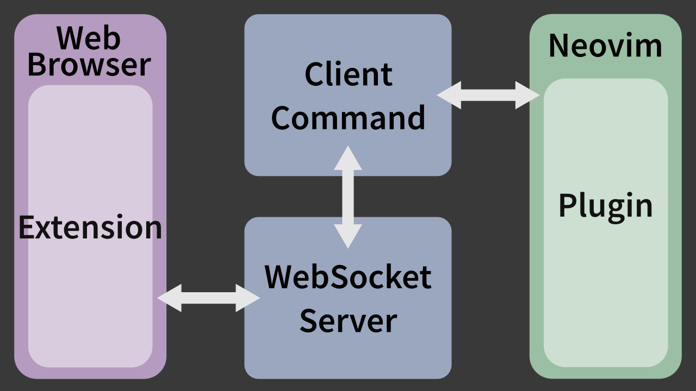

## Neovim as a <br>web browser controller

<p class="title-footer">VimConf 2018 Lightning Talk</p>
<p class="title-footer">by notomo</p>

---

### I'm <span class="pink">n</span>otomo.

- <span class="list-element">web engineer</span>
- <span class="list-element">love vim/neovim from 2016</span>

---

## I want to live 🏠<br>inside the terminal<span class="dot">.</span>

---

## <span class="inactive">I want to live 🏠<br>inside the </span>text editor<span class="dot inactive">.</span>

---

## I need a gui web browser<span class="dot">.</span> 🤔</span>

---

## Work with web browser

<ol>
    <li class="list-element">**work inside the terminal**</li>
    <li class="list-element inactive">go to the web browser</li>
    <li class="list-element inactive">go back to the terminal</li>
    <li class="list-element inactive">repeat</li>
</ol>

# 🏠😄

---

## Work with web browser

<ol>
    <li class="list-element inactive">work inside the terminal</li>
    <li class="list-element">**go to the web browser**</li>
    <li class="list-element inactive">go back to the terminal</li>
    <li class="list-element inactive">repeat</li>
</ol>

# 🏢..🚃......🏠

---

## Work with web browser

<ol>
    <li class="list-element inactive">work inside the terminal</li>
    <li class="list-element inactive">go to the web browser</li>
    <li class="list-element">**go back to the terminal**</li>
    <li class="list-element inactive">repeat</li>
</ol>

# 🏢......🚃..🏠

---

## Work with web browser

<ol>
    <li class="list-element inactive">work inside the terminal</li>
    <li class="list-element inactive">go to the web browser</li>
    <li class="list-element inactive">go back to the terminal</li>
    <li class="list-element">**repeat**</li>
</ol>
# 😣

---

## <span class="text-overflow-center inactive">Work with web browser </span>

<ol>
    <li class="list-element inactive">work inside the terminal</li>
    <li class="list-element inactive">~~go to the web browser~~</li>
    <li value="2" class="list-element">**control the web browser by neovim**</li>
    <li class="list-element inactive">repeat</li>
</ol>

# 💡💡💡

---

## 🎉 ctrlb.nvim 🎉

---

### Ctrlb Command

```text
:Ctrlb {method} [-{param}={value} ...]
:Ctrlb tab/open -url=https://example.com
:Ctrlb tab/reload
:Ctrlb tab/scroll/toBottom
```

---

### Plugin buffers 📝

<span class="large">They enable to control resources.</span>

```text
:CtrlbOpen {bufferName}
:CtrlbOpen bookmarkTree
:CtrlbOpen currentTab
:CtrlbOpen ctrl
:CtrlbOpen historyList
```

---


---

### <h3 class="fix-margin">Architecture</h3>
<p class="no-margin"></p>

---

### <h3 class="fix-margin">Implements</h3>

- <span class="list-element">Web Browser Extension = <u>ctrlb</u></span>
    - Typescript, Web Extension Api
    - https://github.com/notomo/ctrlb
- <span class="list-element">WebSocket Server & Client = <u>wsxhub</u></span>
    - Golang
    - https://github.com/notomo/wsxhub
- <span class="list-element">Neovim Plugin = <u>ctrlb.nvim</u></span>
    - Typescript, neovim/node-client
    - https://github.com/notomo/ctrlb.nvim

---

## Disadvantages 😣

---

## <span class="text-overflow-center">Many dependencies 😑</span>

- <span class="list-element">neovim node.js provider</span>
- <span class="list-element">websocket server</span>
- <span class="list-element">web browser extension</span>

---

## <span class="text-overflow-center">Too much permission <span class="warning">&#x26a0;</span></span>

<span class="large">
    <span class="warning-line left">There is a need to ensure</span>
    <span class="warning-line">the server is not exposed outside.</span>
</span>

---

## <span class="text-overflow-center">🚧 In developement 🚧</span>

---

# Demo

<span class="large">~~Fizz Buzz~~ <br>Vim/Neovim by web browser tabs<span class="large">

---

# Vim

---

# Neovim

---

# Vim/Neovim

---

---

---

---

---

---

---

---

---

---

---

---

---

---

---

---

---

---

---

---

---

---

---

---

---

---

---

---

# 1

---

# 2

---

# 3

---

# 4

---

# 5

---

# 6

---

# 7

---

# 8

---

# 9

---

# 10

---

# 11

---

# 12

---

# 13

---

# 14

---

# 15

---

# Vim

---

# Neovim

---

# Vim/Neovim

---

## Thank you for listening 🙇🙇🙇
